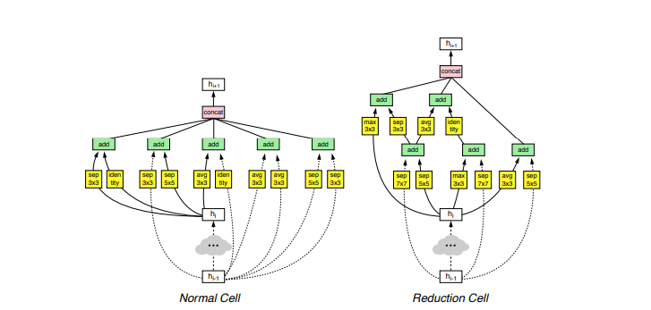
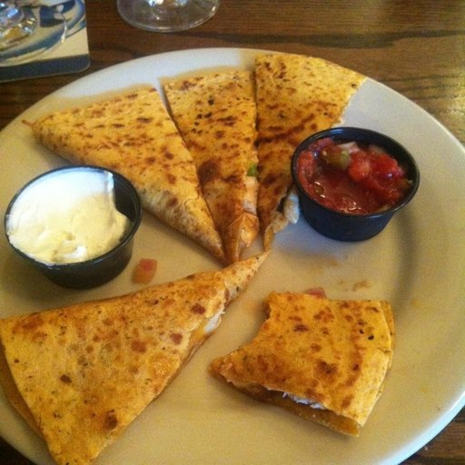

# Food Recognition

Dataset: [Food-11](https://mmspg.epfl.ch/downloads/food-image-datasets/)

In this project, I try out different neural networks to test the efficency(in this case, the loss and accuracy compare to the size of networks and time cost).
I also write an RESTFUL api for testing.
**Crawler in still in the process**

## Getting Started

If you have been doing Deep Learning for a while, there are high chances that you already have these installed. Otherwise, just follow the instruction.

### Prerequisites

Some library you will need to install
Firstly, you will go to [Anaconda Download Page](https://www.anaconda.com/download/) to grab the latest version and follow the instruction.
After that just, it's easy to install other libraries:

```
conda install keras
conda install -c anaconda scikit-learn
conda install flask
conda install -c hellock icrawler
```

## Running this project
**_Note:_** The original dataset isn't suit for ImagePreprocessing yet. So you may want to run this:
```
python3 move_data.py
```
This will create Food-11-subfolder for you and you can check what its structure like.<br />
### Making model
You can find plenty of models i have already built in [this folder](custom_CNN/)
For example:
*VGG16:*
```
def build_vgg16(n_classes):
    # Clear memory for new model
    K.clear_session()
    # Put the VGG16 (cut out the classifer part) and our custom classifier on top
    base_model = VGG16(weights='imagenet', include_top=False, input_tensor=Input(shape=(200, 200, 3)))
    x = base_model.output
    x = GlobalAveragePooling2D()(x)
    x = Dense(4096)(x)
    x = BatchNormalization()(x)
    x = Activation('relu')(x)
    x = Dropout(.5)(x)
    predictions = Dense(n_classes, init='glorot_uniform', W_regularizer=l2(.0007), activation='softmax')(x)

    model = Model(inputs=base_model.input, outputs=predictions)

    # i.e. freeze all convolutional VGG16 layers
    for layer in base_model.layers:
        layer.trainable = False

    # opt = Adam(lr=0.001, beta_1=0.9, beta_2=0.999, decay=1e-6)
    opt = SGD(lr=0.01, momentum=0.1, decay=1e-6, nesterov=True)
    model.compile(optimizer=opt, loss='categorical_crossentropy', metrics=['accuracy', 'top_k_categorical_accuracy'])

    return model
```
You can customize the way you want but if you are beginner, you should go for this setting since I have had changed several times to avoid high bias and high variance.<br />
My top accuracy is [NASNET](custom_CNN/NASNET.py) with **Top-1: 76.5% and Top-5: 98% and val_loss:0.93**<br />
and [VGG16](custom_CNN/VGG16.py) with **Top-1: 75.3% and Top-5: 97% and val_loss:0.89**<br />
Here is what [NASNet Cell](https://arxiv.org/pdf/1707.07012.pdf) looks like:<br />


To train any model, find your function and put it in `train_model.py` like following:
```
model = build_nasnetlarge(11)
```
And then run:
```
python3 train_model.py
```
As you can see in [train_model.py](train_model.py):

```
checkpointer = ModelCheckpoint(filepath='train_data/inception_resnet.{epoch:02d}-{val_loss:.2f}.hdf5', verbose=1, save_best_only=True)
```
The best results got save under `hdf5` file type so you need this library as well.<br />
### Testing
To test, firstly replace this line:
```
model = load_model('train_data/vgg16.17-0.89.hdf5')
```
with the model weight you have trained.<br />
Since I use _Online Augumentation_ for training model,<br />
**Always check for `eval_gen.reset()` if you don't want class output in weird order**<br />
Then just run [test.py](test.py):
```
python3 test.py
```
Here is some result of confusion matrix:<br />
[NASNET](custom_CNN/NASNET.py):
<br />

[VGG16](custom_CNN/VGG16.py):<br />


## Deployment

Run this in terminal:
```
python3 food_api.py
```
and wait until the sever is on in *http://localhost/5000*<br />

Next run this command:
```
curl -X POST -F image=@Food-11-subfolder/Evaluation/0/0_12.jpg http://127.0.0.1:5000/predict
```
Here is the image:<br />
<br />
And you should see something similar to this following json:
```
{
  "predictions":[
    {
    "label":"Bread",
    "probability":0.5589079856872559
  },
    {
    "label":"Egg",
    "probability":0.40930649638175964
  },
    {
    "label":"Fried food",
    "probability":0.028183473274111748
  },
    {
    "label":"Dessert",
    "probability":0.0023826495744287968
  },
    {
    "label":"Meat",
    "probability":0.0006320739048533142
  }
    ],
  "success":true
}
```

## Built With

* [Keras](https://keras.io/) - The Python Deep Learning Library to train and test our models
* [icrawler](https://pypi.org/project/icrawler/) - Crawl Google Image
* [Flask](http://flask.pocoo.org/) - Web Micro-framework


## Authors

* [**Hà Việt Tiến**](https://github.com/tienthegainz)

Make sure to leave a star if you found this helpful.
